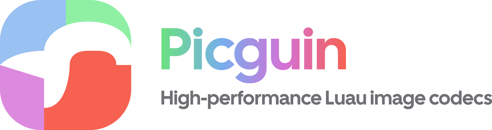

	<picture>
		<source media="(prefers-color-scheme: dark)" srcset="docs/public/heading-dark.svg" />
		
	</picture>
	

	

		
		
	

	<h2></h2>

	

		Picguin is a pure-Luau, strictly typed collection of high-performance image codecs,  
		providing straightforward decoding & encoding for a growing range of formats.
	

	<h3><a href="https://wizevaxel.github.io/picguin/">[ Documentation ]</a></h3>

